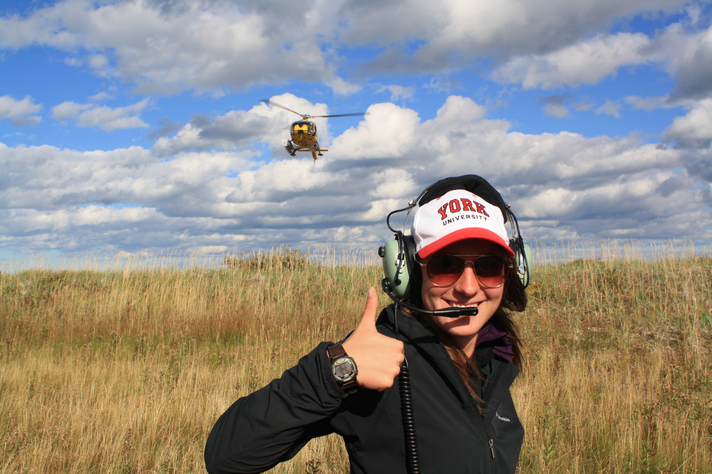

#### Presented by [AGSBS](http://agsbs.yugsa.ca/), [Ecoblender](http://www.ecoblender.org), and [York University](http://www.yorku.ca/index.html)
```{r setup, include=FALSE}
knitr::opts_chunk$set(echo = TRUE)
```

<div style="width:500px; height=350px">

</div>

York University | 
----------------|-----------------------------------
June 19 2017   | **Instructor**: Katie Florko
4 pm - 6 pm   | **Co-instructor**: Alex Filazzola

##General Information

This workshop is designed to introduce participants to two packages: ggplot2 and ggmap. Both of these packages are efficient tools for data visualization, and have several formatting options. This workshop will go through creating different types of plots (i.e., density, stacked bar), formatting (i.e., facet grids), and maps (i.e., using ggplot2 and ggmap). Participants will be encouraged to help one another and to apply what they have learned to their own problems. 

**Who**: The course is aimed at R beginners and novice to intermediate analysts. 

**Where**: 154 Ottawa Road, York University. Room 306 Lumbers (TEL). [Google maps](https://goo.gl/maps/HPSwvGDFeNF2)

**Requirements**: Participants should bring a laptop with a Mac, Linux, or Windows operating system (not a tablet, Chromebook, etc.) with administrative privileges. If you want to work along during tutorial, you must have R studio installed on your own computer. However, you are still welcome to attend because all examples will be presented via a projector in the classroom. Coffees and cookies provided for free. 

**Contact**: Please contact katieflorko@gmail.com for more information.

**Please RSVP** [here](https://www.meetup.com/Greater-Toronto-Area-GTA-R-Users-Group/events/240618369/?a=socialmedia)

## Schedule

Time   | Goal
-------|------------
3:50   | Meet & greet. Test software
4:00  | [Intro to ggplot2](DataViz.intro//DataViz.intro.html)
4:50  | *coffee break*
5:00  | [Making maps using ggplot2 and ggmap](DataViz.Maps.intro//DataViz.Maps.intro.html)
5:30  | Practice
6:00  | Final discussions


## Software

####R

[R](http://www.r-project.org/) is a programming language that is especially powerful for data exploration, visualization, and statistical analysis. To interact with R, we use [RStudio](http://www.rstudio.com/).


Windows        |   Mac OS  X   |      Linux
---------------|---------------|---------------
Install R by downloading and running [this .exe](http://cran.r-project.org/bin/windows/base/release.htm) file from [CRAN](http://cran.r-project.org/index.html). Please also install the [RStudio IDE](http://www.rstudio.com/ide/download/desktop).| Install R by downloading and running [this .pkg](http://cran.r-project.org/bin/macosx/R-latest.pkg) file from [CRAN](http://cran.r-project.org/index.html). Please also install the [RStudio IDE](http://www.rstudio.com/ide/download/desktop).|You can download the binary files for your distribution from [CRAN](http://cran.r-project.org/index.html). Please also install the [RStudio IDE](http://www.rstudio.com/ide/download/desktop)

<div style="width:200px; height=200px">

</div>
<div style="width:300px; height=120px">

</div>
<div style="width:300px; height=120px">


