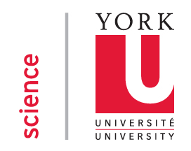

#### Presented by [AGSBS](http://agsbs.yugsa.ca/), [Ecoblender Lab](http://www.ecoblender.org/), and [York University](http://www.yorku.ca/index.html)
```{r setup, include=FALSE}
knitr::opts_chunk$set(echo = TRUE)
```

<div style="width:500px; height=350px">

</div>

York University | 
----------------|-----------------------------------
April 28 2017   | **Instructor**: [Alex Filazzola](http://www.filazzola.info)
10 am - 12 pm   | **Co-instructors**: Thomas Van Zuiden and Katie Florko

##General Information

The purpose of this workshop is to provide tools for a new/novice analyst to more effectively and efficiently analyse their data in R. This hands-on workshop will introduce the basic concepts of R and use of generalized linear models in R to describe patterns. Participants will be encouraged to help one another and to apply what they have learned to their own problems.

**Who**: The course is aimed at R beginners and novice to intermediate analysts. You do not need to have previous knowledge of R.

**Where**: 88 Pond Road, York University. Room 2114 DB (TEL). [Google maps](https://goo.gl/maps/fLeskquHNZs)

**Requirements**: Participants should bring a laptop with a Mac, Linux, or Windows operating system (not a tablet, Chromebook, etc.) with administrative privileges. If you want to work along during tutorial, you must have R studio installed on your own computer. However, you are still welcome to attend because all examples will be presented via a projector in the classroom. Coffees and cookies provided for free. 

**Contact**: Please contact alex.filazzola@outlook.com for more information.

## Schedule

[Live Notepad](https://docs.google.com/document/d/18RSBJ709HMAbzjhcPiq7dvkRRGxe41MrIdj-hq7KkpU/edit?usp=sharing)

Time   | Goal
-------|------------
9:50   | Meet & greet. Test software
10:00  | [R arithmetic and simple commands](R.basics//r.basics.html)
10:30  | [R environment and visualization](R.basics//r.basics.html)
10:55  | *coffee break*
11:05  | [Introduction to GLMs](GLM.intro//GLM.intro.html)
11:30  | [Conducting GLMs in R](GLM.intro//GLM.intro.html)
12:00  | Final discussions


## Software

####R

[R](http://www.r-project.org/) is a programming language that is especially powerful for data exploration, visualization, and statistical analysis. To interact with R, we use [RStudio](http://www.rstudio.com/).


Windows        |   Mac OS  X   |      Linux
---------------|---------------|---------------
Install R by downloading and running [this .exe](http://cran.r-project.org/bin/windows/base/release.htm) file from [CRAN](http://cran.r-project.org/index.html). Please also install the [RStudio IDE](http://www.rstudio.com/ide/download/desktop).| Install R by downloading and running [this .pkg](http://cran.r-project.org/bin/macosx/R-latest.pkg) file from [CRAN](http://cran.r-project.org/index.html). Please also install the [RStudio IDE](http://www.rstudio.com/ide/download/desktop).|You can download the binary files for your distribution from [CRAN](http://cran.r-project.org/index.html). Please also install the [RStudio IDE](http://www.rstudio.com/ide/download/desktop)

<div style="width:200px; height=200px">

</div>
<div style="width:300px; height=120px">

</div>


